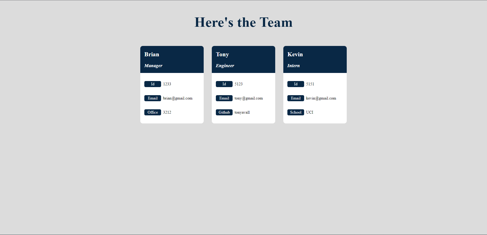
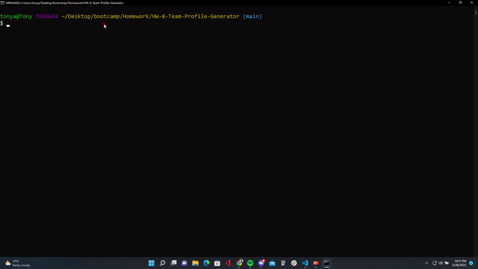

# HW-8-Team-Profile-Generator
A simple web app that gathers user input and generates a team members page.

## Table of Contents
- [Introduction](#introduction)
- [Application Preview](#application-preview)
- [Tech Stack](#tech-stack)
- [Installation](#installation)
- [Project Notes](#project-notes)

## Introduction
An Html5 generator based on user input gathered from npm Inquirer questions. Class objects were created and their functionality were tested through a series of Jest tests. User input is stored in those class objects and the data is then used to create a dynamic html file. The resulting html file can be found in the application preview below.

## Application Preview
Generated Html Example [here.](https://tonyavall.github.io/HW-8-Team-Profile-Generator/)

  
  
  

## Tech Stack
Technologies used includes:
1. JavaScript
2. Node.js
3. npm Inquirer
4. Jest

## Installation
Click on the image for video instructions.

## Project Notes
