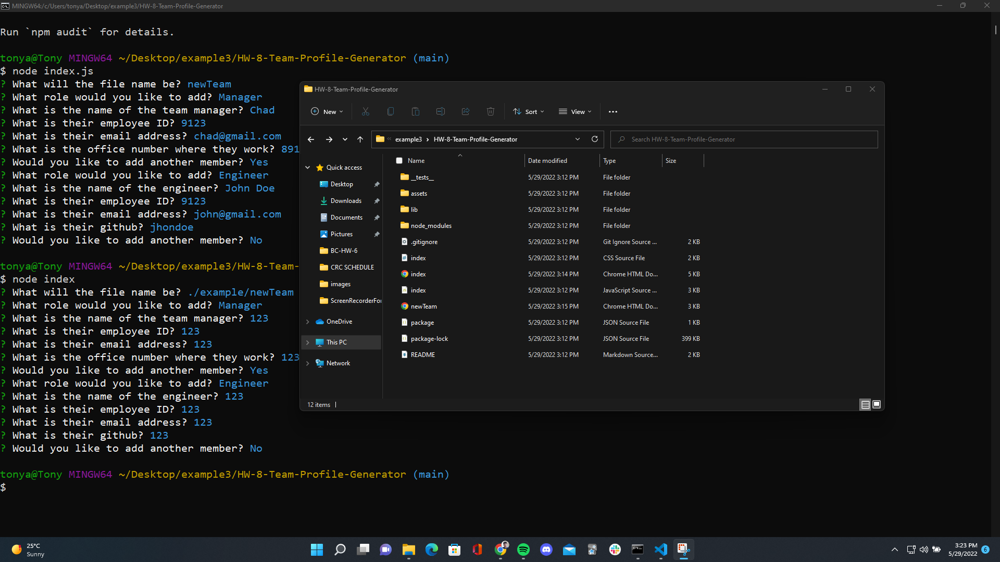

# HW-8-Team-Profile-Generator
A simple web app that gathers user input and generates a team members page.

## Table of Contents
- [Introduction](#introduction)
- [Application Preview](#application-preview)
- [Tech Stack](#tech-stack)
- [Installation](#installation)
- [Project Notes](#project-notes)

## Introduction
An Html5 generator based on user input gathered from npm Inquirer questions. Class objects were created and their functionality were tested through a series of Jest tests. User input is stored in those class objects and the data is then used to create a dynamic html file. The resulting html file can be found in the application preview below.

Questions asked pertains to team members of user choice. Class objects of team member role includes Manager, Engineer, and Intern.

## Application Preview
Generated Html Example [here.](https://tonyavall.github.io/HW-8-Team-Profile-Generator/)

  
  
  

## Tech Stack
Technologies used includes:
1. JavaScript
2. Node.js
3. npm Inquirer
4. Jest

## Installation
Click on the image for video instructions.

## Project Notes
Future To Do's:
1. Add examples for asked questions to make it more understandable.
2. Add console logs to certain points of the questions, such as 'Html File has been Generated'

Different Approaches:
1. Not done recursive questions. It was cool, but I think doing separate functions for each class object would be more maintainable.